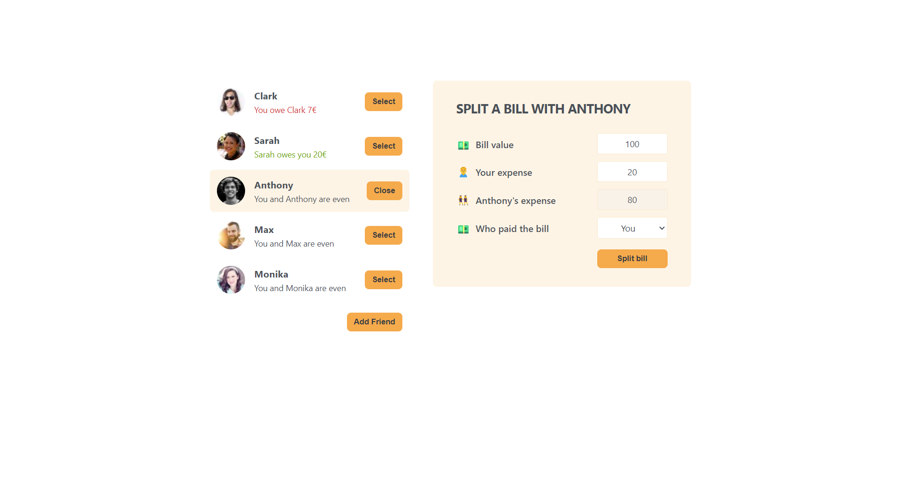

# BillBuddy

## Description

BillBuddy simplifies expense splitting among friends. Add friends, split expenses, and effortlessly track who owes money or to whom you owe money. Get a clear overview of shared expenses and balances, making it easy to manage your financial exchanges among friends.

## Features

- Add bills specifying details like bill amount, payer, and your share; friend's share is calculated automatically.
- Seamlessly track bills and split expenses among friends.
- Gain an overview of shared expenses and balances for better financial clarity among friends.

## Getting Started

Follow these steps to set up and run the app on your local machine:

### Prerequisites

- Node.js: Make sure you have Node.js installed on your computer. You can download it [here](https://nodejs.org/).

### Installation

1. Clone this repository to your local machine.
   ```bash
   git clone https://github.com/niveditapagar/shared-expense-tracker.git
   ```
1. Navigate to the project directory.

   ```bash
   cd shared-expense-tracker
   ```

1. Install project dependencies.
   ```
    npm install
   ```

### Running the App

After installing the dependencies, you can run the app locally.

1. Start the development server.
   ```
   npm start
   ```
1. Open your web browser and visit http://localhost:3000 to use the app.

### Usage

- Add bills specifying details like bill amount, payer, and your share.
- Seamlessly track and split expenses among friends.
- Gain insights into shared expenses and balances.
- Expand your list by adding more friends to manage expenses collectively.

### Screenshots

#### Home


This is the app's main interface that offers an overview of shared expenses and balances.

#### Add Friend Form


Capture details of a new friend: name and image URL, add them to your friends' list.

#### Split Bill Form


Split bills with selected friends by inputting bill details: amount, distribution and payer.

#### Split Bill Form - Filled



Split bills with selected friends by inputting bill details: amount, distribution and payer, and see instant update in summary.
